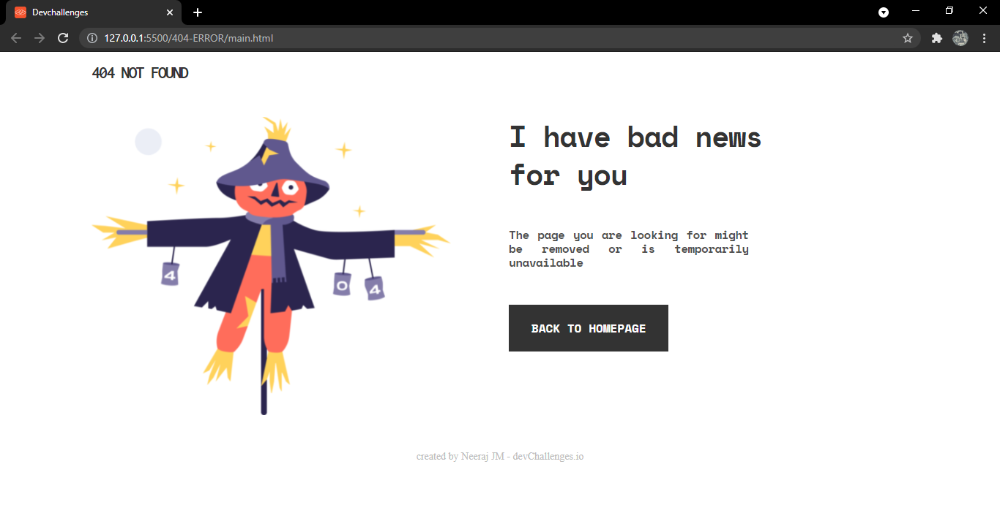

<!-- Please update value in the {}  -->

<h1 align="center">404 Not Found</h1>

   Solution for a challenge from  <a href="http://devchallenges.io" target="_blank">Devchallenges.io</a>.

  <h3>
    <a href="https://github.com/Neerajjr11/404-Not-Found">
      Demo
    </a>
     | 
    <a href="https://github.com/Neerajjr11/404-Not-Found">
      Solution
    </a>
     | 
    <a href="https://devchallenges.io/challenges/wBunSb7FPrIepJZAg0sY">
      Challenge
    </a>
  </h3>

<!-- TABLE OF CONTENTS -->

## Table of Contents

- [Overview](#overview)
  - [Built With](#built-with)
- [Features](#features)
- [Contact](#contact)

<!-- OVERVIEW -->

## Overview

Click [here](https://neerajjr11.github.io/404-Not-Found/) if you want to see a demo.
This challenge has been a great one to strengthen the concepts of responsive design.
With this challenge I have learned the basics of responsive design.

### Built With

<!-- This section should list any major frameworks that you built your project using. Here are a few examples.-->

- [Bootstrap V5](https://getbootstrap.com/)

## Features

<!-- List the features of your application or follow the template. Don't share the figma file here :) -->

This application/site was created as a submission to a [DevChallenges](https://devchallenges.io/challenges) challenge. The [challenge](https://devchallenges.io/challenges/wBunSb7FPrIepJZAg0sY) was create a 404 not found page following the design. The page should be responsive.

## Contact

- GitHub [https://github.com/Neerajjr11](https://github.com/Neerajjr11)